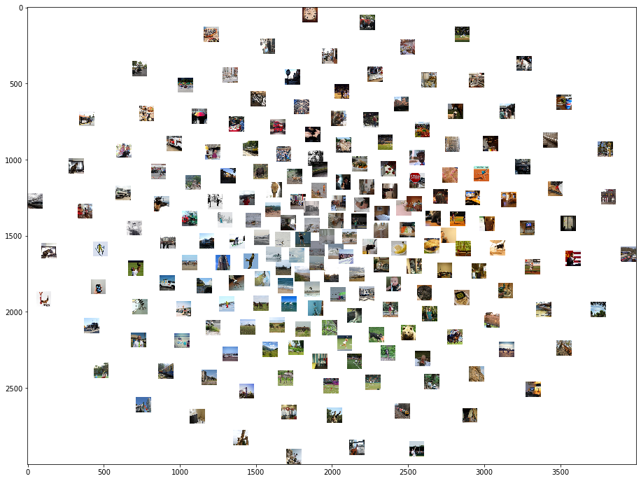

## In this notebook, I am going to show you 

* How to extract the features for a set of images at a certain layer of VGG16 pretrained model with **PyTorch**.
* How to use **PCA(Principle component analysis)** to reduce the feature dimension for better visualization.
* How to use **t-SNE** to visualize the image set based on their similarity of layer features (visualize the n-dimension features as 2-d distance).

## Image set for example
Here, I am using images from [Natural Scene Dataset](http://naturalscenesdataset.org). The Natural Scenes Dataset (NSD) is a large-scale fMRI dataset conducted at ultra-high-field (7T) strength at the Center of Magnetic Resonance Research (CMRR) at the University of Minnesota. The dataset consists of whole-brain, high-resolution (1.8-mm isotropic, 1.6-s sampling rate) fMRI measurements of 8 healthy adult subjects while they viewed thousands of color natural scenes over the course of 30–40 scan sessions. Images used in this dataset are originally from [Microsoft COCO](https://cocodataset.org/#home). I am working on semantic and memory-related exploratory analysis about this dataset. 


```python
from pathlib import Path
import h5py
from torchvision import models
from PIL import Image
from torchvision import transforms
import numpy as np
```

### Read in the image
NSD images are square-cropped images from Microsoft Coco dataset


```python
# import stimuli
sti_dir = Path('/projects/hulacon/shared/nsd/nsddata_stimuli/stimuli/nsd/nsd_stimuli.hdf5').as_posix()
sti = h5py.File(sti_dir,'r')
sti_array = sti['imgBrick']
```

### Read in the pretrianed VGG16 model


```python
# import model
pretrained_model = models.vgg16(pretrained=True).features
pretrained_model.eval()
```


    Sequential(
      (0): Conv2d(3, 64, kernel_size=(3, 3), stride=(1, 1), padding=(1, 1))
      (1): ReLU(inplace=True)
      (2): Conv2d(64, 64, kernel_size=(3, 3), stride=(1, 1), padding=(1, 1))
      (3): ReLU(inplace=True)
      (4): MaxPool2d(kernel_size=2, stride=2, padding=0, dilation=1, ceil_mode=False)
      (5): Conv2d(64, 128, kernel_size=(3, 3), stride=(1, 1), padding=(1, 1))
      (6): ReLU(inplace=True)
      (7): Conv2d(128, 128, kernel_size=(3, 3), stride=(1, 1), padding=(1, 1))
      (8): ReLU(inplace=True)
      (9): MaxPool2d(kernel_size=2, stride=2, padding=0, dilation=1, ceil_mode=False)
      (10): Conv2d(128, 256, kernel_size=(3, 3), stride=(1, 1), padding=(1, 1))
      (11): ReLU(inplace=True)
      (12): Conv2d(256, 256, kernel_size=(3, 3), stride=(1, 1), padding=(1, 1))
      (13): ReLU(inplace=True)
      (14): Conv2d(256, 256, kernel_size=(3, 3), stride=(1, 1), padding=(1, 1))
      (15): ReLU(inplace=True)
      (16): MaxPool2d(kernel_size=2, stride=2, padding=0, dilation=1, ceil_mode=False)
      (17): Conv2d(256, 512, kernel_size=(3, 3), stride=(1, 1), padding=(1, 1))
      (18): ReLU(inplace=True)
      (19): Conv2d(512, 512, kernel_size=(3, 3), stride=(1, 1), padding=(1, 1))
      (20): ReLU(inplace=True)
      (21): Conv2d(512, 512, kernel_size=(3, 3), stride=(1, 1), padding=(1, 1))
      (22): ReLU(inplace=True)
      (23): MaxPool2d(kernel_size=2, stride=2, padding=0, dilation=1, ceil_mode=False)
      (24): Conv2d(512, 512, kernel_size=(3, 3), stride=(1, 1), padding=(1, 1))
      (25): ReLU(inplace=True)
      (26): Conv2d(512, 512, kernel_size=(3, 3), stride=(1, 1), padding=(1, 1))
      (27): ReLU(inplace=True)
      (28): Conv2d(512, 512, kernel_size=(3, 3), stride=(1, 1), padding=(1, 1))
      (29): ReLU(inplace=True)
      (30): MaxPool2d(kernel_size=2, stride=2, padding=0, dilation=1, ceil_mode=False)
    )


Above we can see the convolutional layer structure of VGG. The index of each layer is labeled. I will use the pooling layer 1 as the example.


```python
conv_layer = {
    'conv1': 0,
    'conv2': 2,
    'conv3': 5,
    'conv4': 7,
    'conv5': 10,
    'conv6': 12,
    'conv7': 14,
    'conv8': 17,
    'conv9': 19,
    'conv10': 21,
    'conv11': 24,
    'conv12': 26,
    'conv13': 28}

pooling_layer = {
    'pool1': 4,
    'pool2': 9,
    'pool3': 16,
    'pool4': 23,
    'pool5': 30}

selected_layer = pooling_layer['pool1']
```


```python
selected_layer
```


    4


### Image preprocessing
Here, we define the function that can normailize the input images.


```python
# define preprocess parameters
# mini-batches of 3-channel RGB images of shape (3 x H x W)
preprocess = transforms.Compose([
    transforms.Resize(224),
    transforms.CenterCrop(224),
    transforms.ToTensor(),
    transforms.Normalize(mean=[0.485, 0.456, 0.406], std=[0.229, 0.224, 0.225]),
])

def image_preprocess(img):
    """
    Preprocess the image and create the tensor
    """
    im = Image.fromarray(img)
    input_tensor = preprocess(im) # create tensor
    input_batch = input_tensor.unsqueeze(0)# create a mini-batch as expected by the model
    return input_batch
```

### Feature extraction
Here, we define the function that can extract features at a centain layer


```python
def feature_extract(tensor, selected_layer):
    for index,layer in enumerate(pretrained_model):
#         print(index, layer)
        tensor = layer(tensor)
        if (index == selected_layer):
            return tensor
```

### Read in and preprocess pictures
We are going to use 200 pictures from the stimuli set as an example. We flatten all the feature for each image in order to calculate distance between image features/ use t-SNE


```python
features = []
pic_number = 200
for iImage in range(pic_number):
    img = sti_array[iImage,:,:,:]
    input_batch = image_preprocess(img)
    current_features = np.squeeze(feature_extract(input_batch, selected_layer).data.numpy())
#     print(current_features.shape)
    features.append(np.concatenate(current_features, axis=None))

```


```python
features = np.array(features)
features.shape
```


    (200, 802816)


Since we are using the pooling layer, the feature numbers aren't crazily large. We can skip the following steps for PCA. 
If you are extracting features from convolutional layers, PCA would be very helpful.


```python
# from sklearn.decomposition import PCA

# 
# pca = PCA(n_components=1000)
# pca.fit(features)
```


```python
# pca_features = pca.transform(features)
```

### t-SNE visualization
Here, we are just using some default hyperparameters for t-SNE for a simple visualization. You can try to tune the hyperparameters if you like.


```python
from sklearn.manifold import TSNE
images = sti_array[0:pic_number,:,:,:]
features = np.array(features)
tsne = TSNE(n_components=2, learning_rate=150, perplexity=30, angle=0.2, verbose=2).fit_transform(features)
tx, ty = tsne[:,0], tsne[:,1]
tx = (tx-np.min(tx)) / (np.max(tx) - np.min(tx))
ty = (ty-np.min(ty)) / (np.max(ty) - np.min(ty))
```

    [t-SNE] Computing 91 nearest neighbors...
    [t-SNE] Indexed 200 samples in 4.441s...
    [t-SNE] Computed neighbors for 200 samples in 45.717s...
    [t-SNE] Computed conditional probabilities for sample 200 / 200
    [t-SNE] Mean sigma: 321.907110
    [t-SNE] Computed conditional probabilities in 0.021s
    [t-SNE] Iteration 50: error = 110.1199646, gradient norm = 0.3914785 (50 iterations in 0.065s)
    [t-SNE] Iteration 100: error = 119.6677475, gradient norm = 0.2513522 (50 iterations in 0.065s)
    [t-SNE] Iteration 150: error = 120.5060120, gradient norm = 0.2420261 (50 iterations in 0.063s)
    [t-SNE] Iteration 200: error = 117.5590820, gradient norm = 0.4199304 (50 iterations in 0.063s)
    [t-SNE] Iteration 250: error = 122.9965286, gradient norm = 0.2279717 (50 iterations in 0.060s)
    [t-SNE] KL divergence after 250 iterations with early exaggeration: 122.996529
    [t-SNE] Iteration 300: error = 2.4189911, gradient norm = 0.0285375 (50 iterations in 0.060s)
    [t-SNE] Iteration 350: error = 1.8055801, gradient norm = 0.0019180 (50 iterations in 0.062s)
    [t-SNE] Iteration 400: error = 1.6958097, gradient norm = 0.0008569 (50 iterations in 0.062s)
    [t-SNE] Iteration 450: error = 1.6566454, gradient norm = 0.0006347 (50 iterations in 0.061s)
    [t-SNE] Iteration 500: error = 1.6307240, gradient norm = 0.0004043 (50 iterations in 0.061s)
    [t-SNE] Iteration 550: error = 1.6122439, gradient norm = 0.0003583 (50 iterations in 0.060s)
    [t-SNE] Iteration 600: error = 1.5946932, gradient norm = 0.0002276 (50 iterations in 0.059s)
    [t-SNE] Iteration 650: error = 1.5851456, gradient norm = 0.0002688 (50 iterations in 0.057s)
    [t-SNE] Iteration 700: error = 1.5735952, gradient norm = 0.0011064 (50 iterations in 0.057s)
    [t-SNE] Iteration 750: error = 1.5616177, gradient norm = 0.0003782 (50 iterations in 0.057s)
    [t-SNE] Iteration 800: error = 1.5549071, gradient norm = 0.0001757 (50 iterations in 0.058s)
    [t-SNE] Iteration 850: error = 1.5460689, gradient norm = 0.0002423 (50 iterations in 0.057s)
    [t-SNE] Iteration 900: error = 1.5415170, gradient norm = 0.0001737 (50 iterations in 0.057s)
    [t-SNE] Iteration 950: error = 1.5383173, gradient norm = 0.0000928 (50 iterations in 0.057s)
    [t-SNE] Iteration 1000: error = 1.5367311, gradient norm = 0.0000665 (50 iterations in 0.059s)
    [t-SNE] KL divergence after 1000 iterations: 1.536731


```python
from matplotlib.pyplot import imshow
import matplotlib
width = 4000
height = 3000
max_dim = 100

full_image = Image.new('RGBA', (width, height))
for img, x, y in zip(images, tx, ty):
    tile = Image.fromarray(img)
    rs = max(1, tile.width/max_dim, tile.height/max_dim)
    tile = tile.resize((int(tile.width/rs), int(tile.height/rs)), Image.ANTIALIAS)
    full_image.paste(tile, (int((width-max_dim)*x), int((height-max_dim)*y)), mask=tile.convert('RGBA'))

matplotlib.pyplot.figure(figsize = (16,12))
imshow(full_image)
```


    <matplotlib.image.AxesImage at 0x2aab23e3dcf8>





You can see clear color and shape clusters in the visualization. This makes sense since the pooling layer 1 is at a very early stage, which caputres relatively low level features of the images.

In below, the visulation based on pooling layer 5 is presented.
You can clearly see some semantic category clusters, like bears and bananas.


```python
Image(filename='samples/pool5_600pics_try2.png') 
```


### Reference
1. https://github.com/utkuozbulak/pytorch-cnn-visualizations
2. https://nextjournal.com/ml4a/image-t-sne

