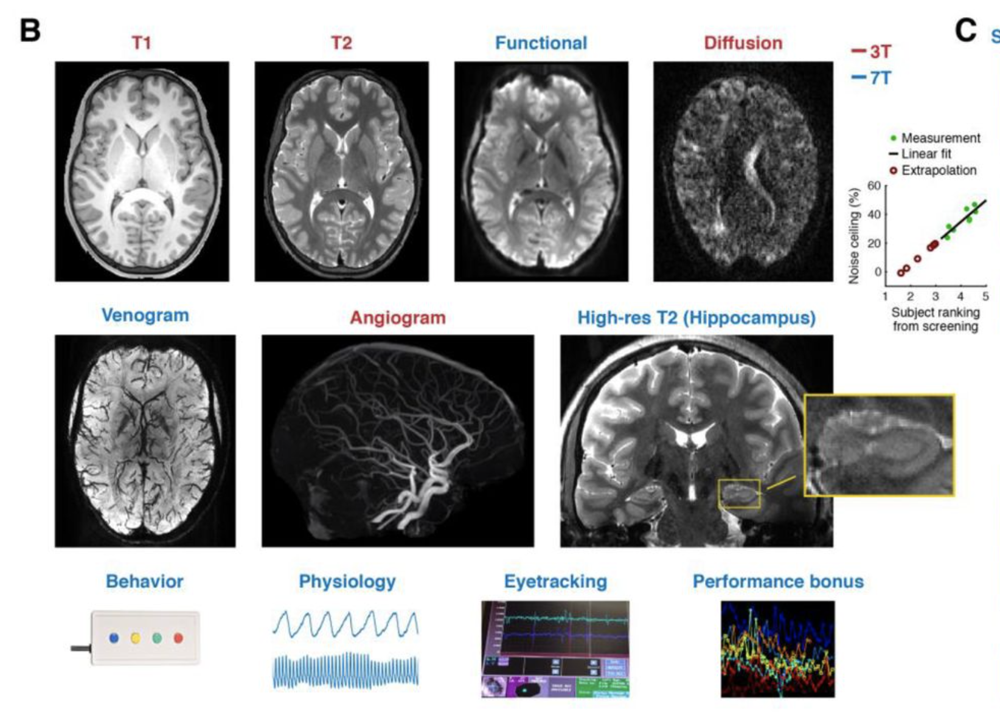

## Question

## Background
When a stimulus from the past is re-encountered, this can elicit increased neural activation relative to a novel stimulus (repetition enhancement) or decreased activation (repetition attenuation). Studies of episodic memory have consistently found that repetition enhancement occurs within parietal cortex and that these enhancement effects are related to behavioral expressions of successful episodic remembering. Repetition attenuation, in contrast, is more typically observed in regions of occipitotemporal cortex and is less consistently related to behavioral expressions of episodic memory. Separately, pattern-based fMRI studies have found that information about the content of stimuli is reflected in both parietal cortex and ventral temporal cortex, but it is less clear how or whether these content representations are integrated with repetition-related memory signals. 

## Methods
### Dataset
In this study, we utilize the [Natural Scene Dataset (NSD)](http://naturalscenesdataset.org), which is 7T fMRI study with data size around **2+ TB**. In this dataset, eight participants performed a continuous recognition task spanning 30-40 fMRI scan sessions and up to 10,000 unique, naturalistic images. 

### Vectorize memory content
In the study, the stimuli subjects remembered were images from [COCO dataset](https://cocodataset.org/#home). Thus, to vectorized the memory content information, we can extract information from each image.

#### Semantic models
Since each image from COCO dataset are annotated by human workers with English, we started by analyzing the image content with two popular semantic models: [Word2vec](https://arxiv.org/abs/1301.3781) and [Fast sentence embedding (fse)](https://github.com/oborchers/Fast_Sentence_Embeddings). However, after comparing the similarity analysis based on the embeddings from these two semantic models and our human raters on a small subset of the images, we were not satisfying with these two methods in terms of capturing the image content information.

#### VGG16 
We believe the undesirable results from the semantic models are due to the quality of the annotation: each image was annotated by five human workers, and each worked wrote one single sentence to descripe the image. With this setting, the richness of the annotation is very limited so that the annotation is not representative to the image content. To solve this problem, we believe quantifying the image content directly from the visual part of the image would be a closer approximation of the memory content. After literature review, we decided that [VGG16](https://arxiv.org/abs/1409.1556), a convolutional neural network designed for image content classification and detection, would be a good candidate for our purpose.
We passed the images through VGG16 and used the output from the last fully connected layer (fc3) as the content vector of each image. To 

### Model prediction

### Conclusion
We calculated the difference in multivoxel fMRI activations between the first presentation (initial encoding) and second presentation (retrieval) for each stimulus and tested whether these repetition-related differences in activity patterns carried information about the visual content of the image. 

To quantify the content of each image, we passed the images through VGG16, a convolutional neural network designed for image content classification and detection. We then reduced features from the output layer to 10 PCA dimensions and used ridge regression to test whether repetition-related changes in fMRI activity patterns predicted the PCA content scores. 

We found that repetition-related differences in medial and lateral parietal cortex predicted image content
significantly above chance level (1000 permutation test). Moreover, these predictions were significantly better for hits (correct recognition) compared to misses (failed recognition) indicating that the presence of content information was directly related to successful recognition. Interestingly, repetition-related differences in occipitotemporal cortex also predicted image content, but the success of these predictions were less dependent on successful behavioral recognition. Collectively, our results indicate that repetition-related enhancements which have consistently been observed in parietal cortex directly integrate information about the content of what is being remembered.

