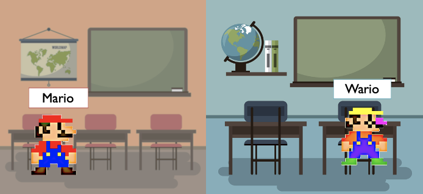

Given the vast number of memories that humans store, overlap between memories is inevitable. For example, two students in your new class might look very similar to each other, and you find it hard to distinguish them. Similarity between memories is a primary cause of interference and forgetting. 

However, with adequate learning, our brain can 

In this study, by using fMRI (Functional magnetic resonance imaging) technique, we tried to answer how does our brain resolve memory interference caused by similarity.

We utilized a set of image stimuli that each image’s color can be rotated along a 360° color wheel 

changes in neural activity patterns may reflect adaptive changes in memory content. For example, if two vacations to the same city were associated with different weather conditions, then weather-related information may be a salient component of corresponding memories and weather-related differences between those vacations may be exaggerated to improve memory discriminability (e.g., “That was the year it was really cold,” vs. “That was the year it was really hot”). 

Here, we show that when remembering highly similar objects, subtle differences in the features of these objects are exaggerated in memory in order to reduce interference. These memory distortions are reflected in, and predicted by, overlap of activity patterns in lateral parietal cortex. These findings provide unique insight into how memory interference is resolved and specifically implicate lateral parietal cortex in representing feature-specific memory distortions.

