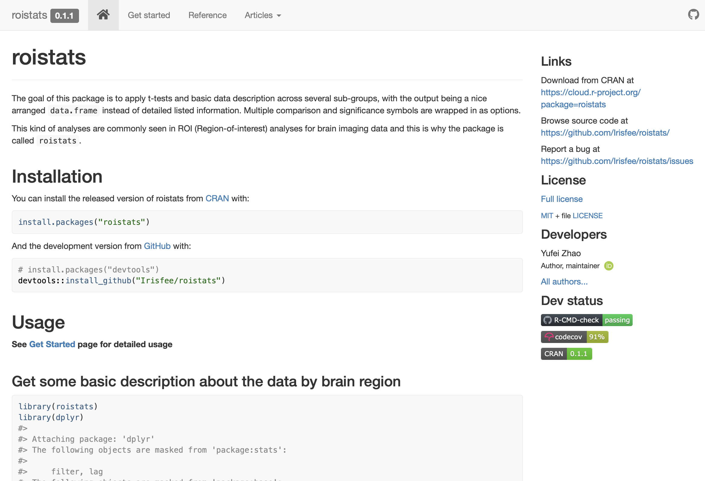

While working on my first grad school project, I found in our research field, the analysis of multiple testing is involved in almost every project, since we need to compute same analysis over multiple brain regions. Thus, we need to apply same basic descriptive statistics, different variants of t-tests, and multiple comparison correction to multiple groups.

Quickly I got tedious about writing similar long pipelines of doing the multiple testing analysis, so I decided to wrap up my pipeline into functions, and combine functions into a package, and {roistats} came out! All the functions from the package can be used in combination with dplyr.

For the detail of what functions are included and how to use them, check out the website for this package: https://irisfee.github.io/roistats/index.html

